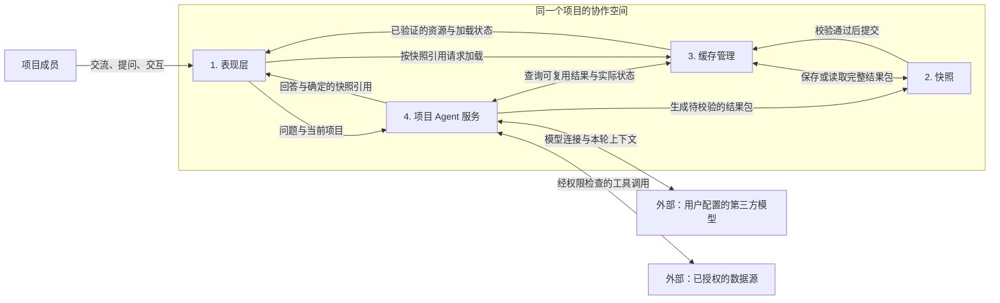

# 序言 · 项目群聊 PRD v0.2

更新日期：2026-09-11

本文明确产品的四个顶层模块、项目边界和模块之间的关系。当前版本已接入真实文本模型，并在 P1 建设本地 dummy 快照包与隔离回放；实现与验收状态以 docs/STATUS.md 为准。本文中的自动上下文、记忆、数据权限、真实快照生成、生产持久化和缓存服务是后续实现要求。

## 1. 产品定位

序言是一个以项目为单位的群聊协作产品。项目成员在同一个对话空间中交流，每个项目始终有一个名为“序言”的 Agent。

用户通过自然语言与序言讨论项目。序言基于该项目的配置、上下文、记忆和授权数据理解问题，按需返回：

- 自然语言回答；
- 已有快照的引用；
- 根据本次数据生成的新快照，包括数据、表现层及完整依赖。

群聊界面保持安静、简洁、清晰。复杂信息在 Agent 回复中的快照视图里展开；模型接入、取数、校验和缓存管理在后台完成。

**项目是协作、Agent 配置、上下文、记忆、权限和缓存隔离的共同边界。** 不同项目的序言可以同名，但配置和状态独立。

## 2. 四个顶层模块

| 模块 | 核心职责 | 主要管理的对象 | 与其他模块的边界 |
| --- | --- | --- | --- |
| **1. 表现层** | 项目与成员管理、群聊、消息、快照查看与交互、设置入口 | 项目导航、成员视图、消息及快照引用、临时界面状态 | 展示服务返回的事实与状态；不直接持有模型或数据源密钥 |
| **2. 快照** | 定义、封装、校验和回放某次查询的完整结果 | 查询上下文、数据、生成的表现层、资源、manifest | 提交后不可变；不保存访问计数、TTL 等可变缓存状态 |
| **3. 缓存管理** | 查找可复用结果、管理新鲜度与默认版本、存储加载和淘汰 | 持久目录、active 指针、各级缓存条目、生成锁、访问统计 | 判断实际命中与过期；不理解业务问题、不生成回答或页面 |
| **4. 项目 Agent 服务** | 接入第三方模型、管理项目上下文与记忆、调用授权工具、生成回答与快照 | 项目 Agent 配置、上下文版本、项目记忆、工具授权、执行记录 | 模型负责推理与生成；服务端负责权限执行、流程控制和提交门槛 |

四个模块是逻辑职责划分，不要求第一版拆成四个独立部署的微服务。身份认证、持久存储、凭据保管和审计作为共享基础设施支撑四个模块；项目归属、成员和角色以服务端的统一记录为准。

### 两种表现层

- **产品表现层**：稳定的群聊应用外壳，包括导航、成员、消息、输入框和设置。由产品维护。
- **快照表现层**：序言根据具体数据生成的表格、图表、看板、日历、流程图或交互页面，随快照保存。

两者通过快照引用和受控挂载点连接。Agent 不重新生成整个群聊应用；快照内部页面也不自行获得群聊应用的权限。

## 3. 模块关系



第三方模型和业务数据源是外部依赖，不是额外的产品模块。

随网站发布的是序言 Agent 服务及其接入能力。第三方模型通过用户配置的连接调用，不随网站内置模型权重。序言的身份、项目记忆和快照属于本产品，更换模型不删除这些状态。

## 4. 模块职责

### 4.1 表现层

以项目群聊为主界面，提供：

- 项目新建、重命名、归档与恢复，侧栏进入页面时默认隐藏，可随时展开；
- 按项目独立的成员管理，包括添加、移出及角色管理；
- 成员交流、向序言提问、展示回答和快照引用；
- 快照内交互、展开查看、加载失败和不可用状态；
- 清晰而轻量的状态提示，例如“已命中缓存”“已生成快照”“正在更新”；
- 面向有权限用户的项目管理中的“上下文”和工作空间“模型与连接”入口。

成员管理必须在服务端落地，不能仅通过隐藏前端按钮限制操作。移出成员不删除其历史消息；被移出的成员失去后续项目访问权限，历史资源访问也需重新鉴权。新增成员按项目访问规则读取历史内容，不能因此自动获得超出项目授权范围的外部数据权限。

群聊消息绑定确定的 `snapshotId`，不能绑定一个会变化的 active 指针。页面入口从已校验的 manifest 解析，不接受聊天正文提供的任意执行入口。

排序、筛选、展开等临时界面状态可以留在当前浏览中。需要保存新的数据或确定的交互状态时，通过 Agent／宿主流程生成新结果，不修改历史快照。

### 4.2 快照

快照是某个项目在特定查询、上下文、数据版本和生成时刻下的完整结果包：

```text
Snapshot = QueryContext + Data + Presentation + Assets + Manifest
```

**外层协议统一，内部数据和表现形式开放。**

- 数据可以是 JSON、CSV、文本、PDF、图片、音视频、其他二进制格式或多文件集合；
- 表现层由 Agent 根据这份数据生成，第一阶段统一为浏览器可运行的 H5 包；
- 数据与表现层通过显式资源引用和数据绑定连接，不强制某一种业务字段或视觉模板；
- 必需的代码、样式、媒体、字体、解码器等依赖随包保存，不能依赖内容会变化的远程 URL 才能回放；
- manifest 描述身份、作用域、查询指纹、资源类型、大小、内容校验值、入口和绑定关系；
- 只记录追溯该次结果所需的相关上下文及版本，不复制整个项目的聊天和记忆；
- 提交后不可变；数据、页面或保存的初始状态改变，均生成新 `snapshotId`。

推荐逻辑包结构：

```text
snapshot/
  manifest.json
  query.json
  data/                 任意格式的数据及索引文件
  presentation/         构建后的 H5 入口和页面文件
  assets/               页面所需依赖，可选
```

可复现指已冻结的数据、代码、资源和初始状态能够重新加载；不承诺再次运行模型得到相同结果，或跨设备逐像素一致。

详细字段与校验设计见 [快照数据协议设计稿](docs/SNAPSHOT_SPEC.md)。P1 的机器可读 Schema 与完整 dummy 示例已补齐；当前 web runtime 支持范围见 docs/VIEWER_PROTOCOL.md，包外缓存设计仍待后续实现。

### 4.3 缓存管理

缓存管理模块负责回答：是否存在可复用结果、是否足够新、从哪里加载，以及何时淘汰。

分开管理以下对象：

| 对象 | 用途 |
| --- | --- |
| 持久目录 | 记录已提交快照的位置、可用性和完整性，支撑历史回放 |
| active 指针 | 为同一项目、同一查询身份选定默认快照 |
| 缓存条目 | 分别记录服务端和浏览器缓存的驻留、过期、容量与访问状态 |
| 生成任务与锁 | 协调并发生成，避免失败或旧任务覆盖新结果 |
| 保留与引用记录 | 区分缓存淘汰和持久删除，保护历史消息引用 |

查询身份至少覆盖：项目及所属工作空间、标准化意图与参数、相关上下文／记忆版本、有效权限范围、影响结果的区域设置、数据源选择和明确的表现要求。

- 相同自然语言措辞不一定命中；不同措辞也不能只因“意思相近”就直接复用。
- 相关上下文或记忆变化必须进入匹配判断；权限变化必须重新校验，不能依赖旧命中结果。
- 查询固定数据版本时，把版本纳入身份；查询“最新”时，保留稳定查询身份，再检查实际数据版本、TTL 或主动失效信号。
- 命中、过期、生成与加载状态由服务产生，模型不能自行编造这些状态。

生命周期分成相互独立的维度：

```text
生成任务： staging → validated → committed，或 failed
持久目录： available → deleting → deleted
默认版本： active 指针指向某个已提交快照
数据新鲜度： fresh / stale / expired
各级缓存驻留： resident / evicted
```

超过软 TTL，可以展示旧结果并后台刷新；超过硬 TTL，不再作为新查询的有效命中。明确回放历史消息时，在权限与保留策略允许下仍可读取旧快照，并保留其原始时间。

缓存淘汰不等于删除持久包。重新装载旧包不能把其数据新鲜度重置。访问时间、TTL、计数、优先级和存储位置放在包外管理。

只有完整包持久化且校验成功后才能更新 active；提交时还需进行版本比较，避免并发覆盖。生成失败不替换旧指针，不改变历史消息。

### 4.4 项目 Agent 服务

每个项目拥有一份独立的序言 Agent 配置。服务按该配置组织模型调用，而不是让所有项目共享一套无差别上下文。

职责包括：

1. 根据项目和发起成员定位有效配置、上下文及权限；
2. 从项目记忆、知识资料、相关历史消息和已引用快照中选择本轮需要的信息；
3. 调用项目选定的第三方模型，解析提问并形成标准化意图；
4. 请求缓存匹配，或通过授权工具查询／计算真实业务数据；
5. 生成自然语言回答和必要的快照表现层；
6. 通过隔离的构建与校验流程提交快照候选包；
7. 根据实际执行结果回复，并记录必要的来源、工具调用和生成信息。
8. 持续从项目对话与授权资料中整理新的事实、决策和纠正，自动更新项目上下文和记忆。

“生成数据”包含查询、整理、计算和派生结果，不能把模型编造的数字当成取回的真实业务数据。

Agent 可以提出工具调用意图；服务端工具执行层负责检查权限、执行请求和返回结果。第一阶段以读取为主，外部写入和业务变更留给单独设计的授权流程。

模型连接失败时，明确报告新生成暂不可用；已授权的历史消息与已保存快照仍可加载。直接回放历史快照不依赖第三方模型在线。

## 5. 配置、上下文和记忆的归属

### 5.1 工作空间提供连接，项目拥有 Agent 配置

| 层级 | 管理内容 | 操作入口与权限 |
| --- | --- | --- |
| 工作空间 | 第三方服务连接、接口地址、凭据、可选模型、默认连接与使用额度 | 工作空间管理员：“模型与连接” |
| 项目 | 独立的初始背景、Agent 自动维护的当前上下文与记忆、获准使用的模型及数据源 | 创建者输入初始背景；序言接管持续维护。用户通过项目管理 → “上下文”查看与必要纠正 |
| 当前对话／请求 | 本轮问题、相关消息、引用快照、临时工具结果和临时交互状态 | 服务按项目配置组装，成员通过正常对话使用 |

**模型的上下文配置跟着项目走。** 工作空间统一保管连接与密钥，不统一覆盖各项目的背景、指令或记忆。

每个项目的模型选择支持“继承工作空间默认”或“从已授权连接中指定模型”。继承是一条项目配置规则；实际调用时记录解析后的模型与配置版本，便于追溯。项目管理员只能引用获准使用的连接，不能因此查看原始密钥。

日常群聊不展示供应商、密钥和高级参数。首次模型接入由工作空间管理员完成；项目创建者提供一次初始背景后，由序言在项目对话中持续维护上下文。普通成员无需理解模型配置或手动维护记忆即可协作。

项目管理只提供一个“上下文”入口，内含一个统一编辑框，不拆分“初始背景”和“项目链接”等栏目。创建者在启动时输入一次项目背景、目标、要求和资料链接；后续同一份上下文由序言维护，用户可查看和必要纠正。记忆管理、摘要策略、上下文窗口、会话重置和跨项目切换均为系统内部职责，不向用户提供对应配置项。数据源的接入授权仍由有权限的用户完成，序言不能通过自动更新上下文自行扩大权限。

当前 Demo 仅提供统一上下文编辑框的本地保存；真实自动摘要、持续更新与持久记忆尚未实现。不能把保存背景或预设回复宣称为模型已接管维护。

### 5.2 上下文与记忆

| 类型 | 内容 | 更新方式 |
| --- | --- | --- |
| 项目初始背景 | 目标、背景、术语、角色分工、工作要求、知识资料 | 创建者提供一次，作为可追溯的起点；无需日常反复填写 |
| 当前项目上下文 | 初始背景与后续对话形成的最新项目理解 | 序言自动提取、汇总、去重和更新，保留来源与内部版本 |
| 项目长期记忆 | 有依据的决策、约束、结论和持续事项 | 序言自动组织、检索与更新，内部记录来源、确定程度、时间及版本 |
| 本轮上下文 | 本轮问题、筛选后的相关历史与记忆、快照引用、工具结果 | 每次请求按需组装，有容量边界 |

### 5.3 自动维护规则

1. 创建者输入一次上下文后即可开始对话。成员在对话中提供有项目价值的新背景、约束、资料链接或决策时，由序言自动识别并追加到该项目的统一上下文，不要求再次到设置页填写。
2. 对有依据且无歧义的信息，序言自动追加、去重和汇总；遇到明确纠正时更新相应内容，避免一味追加造成冲突。无需逐条请求用户批准摘要。
3. 识别“提议”“问题”“假设”和“已决定”的区别，不把 Agent 自己的推测当成项目事实。实质冲突或关键歧义在正常对话中澄清，不新增一套记忆审批界面。
4. 记录信息来自哪条消息或哪个授权数据源。明确纠正应更新当前理解；旧版本保留用于追溯，不能继续与新结论并列作为有效事实。
5. 摘要只是对原始信息的组织，不替代原始消息与资料。后续提问需要时仍可检索来源；变化频繁的业务数据按需重新查询。
6. 摘要可在后台执行，但本轮已收到、尚未汇总的相关消息仍应进入后续请求，不能因摘要延迟漏掉最新信息。
7. 自动更新失败时保留上一份有效上下文及待处理消息，可重试；并发更新不得让旧摘要覆盖新结论。
8. 只有影响当前问题的实质上下文变化才影响缓存复用；寒暄或无关对话不应使全部快照失效。新版本不修改历史快照。

用户的日常责任是正常交流；序言负责维护项目理解。用户可以在“上下文”中查看结果，或直接在对话中要求纠正，无需管理记忆条目、压缩阈值或摘要时机。

项目记忆保存在本产品的持久存储中，不依赖供应商会话状态。更换模型不丢失项目记忆；项目之间默认不共享。第一阶段以群聊共享的项目记忆为主，不自动把成员个人资料或其他项目的记忆引入群聊。

### 5.4 跨项目隔离与切换（内部机制）

同一个第三方模型连接可以服务多个项目，但每次调用必须按当前项目组装独立上下文，绑定该项目的有效权限、记忆和工具范围。不得复用另一个项目的供应商会话标识、检索状态或工具临时结果。

切换项目时，系统自动切换本轮上下文；持久项目记忆继续保留。返回项目时从其最新状态恢复，不要求用户点击“重置模型”或重新介绍项目。更换供应商或模型时同样由服务重新组装上下文。

项目身份和权限必须贯穿后台摘要、跨站检索、生成与缓存请求，不能只靠提示词约束项目隔离。这些过程不在产品界面暴露操作按钮。

### 5.5 数据权限

数据源连接凭据与项目可用范围分开管理。项目只能使用已获授权的连接、工具、数据集合及操作范围。

每次工具执行和快照读取都要检查：发起人的当前权限、项目授权范围，以及结果是否允许向本次群聊接收成员公开。某个人可读取的资料不能自动公开给整个群聊。

权限由可信服务执行，不由模型决定。第三方模型只接收本轮获准使用的必要上下文；密钥不进入提示词、快照包或生成的页面。

## 6. 核心用户流程

### 6.1 建立项目

1. 管理员在工作空间接入第三方模型并验证连接。
2. 用户创建项目，获得独立的序言 Agent 配置和项目记忆空间。
3. 项目默认继承可用模型连接；创建者在“上下文”中一次性提供初始背景、工作要求及资料链接。
4. 有权限的管理员添加成员并授权项目数据源。
5. 成员开始交流并向序言提问；序言随后从对话与授权资料中自动总结和更新项目上下文。

未完成模型接入时仍可创建项目、管理成员和浏览已有内容；需要模型的操作显示明确的配置提示。新项目不得自动继承其他项目的数据和记忆。

### 6.2 提问与复用

1. 表现层提交项目、发起成员、问题及当前引用。
2. Agent 服务校验权限，组装相关上下文，解析标准化查询意图。
3. 服务计算包含有效上下文和权限范围的查询身份，请求缓存管理查找。
4. 找到可复用结果时，返回确定的快照引用、实际命中状态和回答；不重新生成整个快照。
5. 未找到有效结果时，Agent 调用授权工具取得数据，生成表现层与完整快照候选包。
6. 校验数据引用、依赖完整性、文件大小、内容 hash 和运行边界；通过后持久化并提交。
7. 缓存管理在并发检查通过后更新 active，返回确定的引用。
8. 表现层按引用加载并校验资源，在消息中的受控容器内展示。

普通交流和不需要复杂展示的回答可以只返回文本，不强制每条消息创建快照。

### 6.3 刷新、回放与成员变化

- 用户请求刷新或旧结果过期时，重新执行所需步骤并生成新快照；旧消息继续引用旧快照。
- 项目指令、相关记忆或权限变化后，后续请求使用新的有效上下文，不盲目复用旧结果。
- 项目归档后保留对话、Agent 配置、记忆、成员与快照引用；恢复后继续使用。归档不等于物理删除。
- 成员被移出或数据源授权撤销后，后续读取按新权限检查；已失去权限的历史快照显示不可访问。
- 持久快照被明确删除后保留不可用提示，不偷偷替换为另一份结果。

## 7. 实现方向与不变量

初步技术方向沿用现有 PRD，但不影响上述模块边界：

- 产品界面及 H5 表现层可采用 React、TypeScript、Vite；快照保存构建后的资源，不依赖开发服务器。
- Redis 用于热缓存、active 索引、锁及统计；不能作为快照包、项目记忆、成员权限或持久目录的唯一存储。
- 完整快照包保存到对象存储；项目、消息、Agent 配置、记忆、引用关系等通过持久数据库管理。
- 浏览器使用 IndexedDB 保存元数据与数据，Service Worker／Cache Storage 管理静态资源；资源下载与校验在事务外完成，随后用短事务提交。
- Agent 服务包含模型适配、上下文组装、记忆管理和工具执行能力；执行记录保存实际模型、配置版本、来源与生成耗时等信息。
- Agent 生成的表现层默认隔离执行，不直接挂载到宿主 React Root；确有受控内部组件时另行定义可信运行方式。

必须持续满足：

1. 项目上下文、记忆、成员及数据权限独立，跨项目访问需要明确授权。
2. 已提交快照不可变；历史消息的快照引用稳定。
3. 新旧数据、表现层及初始状态不能错配。
4. 缓存过期、淘汰与持久删除是不同操作。
5. 权限检查、内容校验和真实缓存状态不能由模型输出替代。
6. 失败的生成不能覆盖旧结果，未知或不兼容的页面不能直接执行。
7. 模型密钥和数据源凭据只在可信服务端保管与使用。

## 8. 阶段范围与验收

### 当前实现基线

现有项目群聊、侧栏、项目与成员管理交互继续保留，项目记录仍在页面内存。文本 Agent 已真实调用模型。P1 以明确标注的 dummy 文件包验证快照校验、隔离展示与稳定引用；没有真实业务取数、动态生成、持久项目授权或缓存服务。详见 docs/STATUS.md。

### 第一阶段真实闭环

- 用户可配置第三方模型；每个项目拥有独立的序言配置、上下文及持久记忆。
- 项目可引用获准使用的模型与数据源连接，普通成员无需配置模型即可对话。
- 初始背景输入后，序言能根据对话自动汇总和更新上下文，不依赖成员持续手动维护。
- 能区分明确决策与提议、处理纠正并保留来源；更新失败或并发时不丢信息、不以旧覆盖新。
- 新建项目、切换项目和更换模型时，配置、记忆与数据不串用、不丢失；用户无需执行上下文重置。
- 项目管理只有统一的“上下文”入口，不暴露记忆策略、摘要参数或模型会话管理。
- 至少接通一种只读数据源；取数与结果分享满足当前成员及项目权限。
- 相同有效查询身份可以复用快照，相关上下文或权限变化后不会错误命中。
- 未命中时能生成并校验完整的“数据 + H5 表现层 + 依赖”结果包。
- 群聊内可以加载、交互和回放快照；普通文本回答不强制生成快照。
- 模型、取数、构建或校验失败均有明确状态，且保留旧快照。
- 已授权的历史快照回放不依赖模型在线，缓存淘汰后可从持久存储恢复。
- 各级缓存有容量和时间边界，能够区分新查询命中与历史回放。
- 可统计命中率、生成耗时、加载耗时、失败率、快照大小和淘汰数量。

多 Agent 协作、外部系统写入、多运行时快照和跨项目共享记忆不纳入第一阶段闭环。
