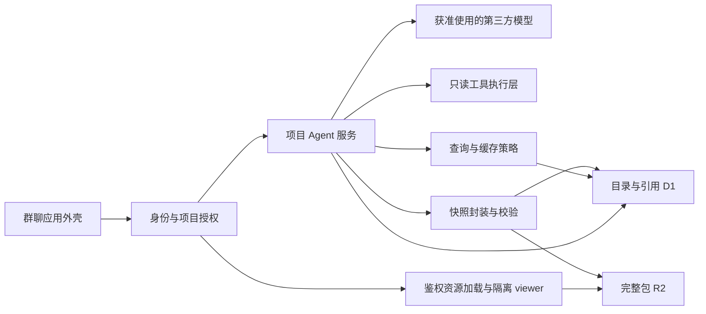

# 序言：后续研发框架与开发计划

版本：计划 v2 · 2026-09-11 · P1 已获用户授权实施

本文件保留完整研发规划。P1 已获用户授权并完成开发与自动检查，实际状态见 docs/STATUS.md；后续阶段尚未开始。

## 1. 建议批准的方向

保留现有群聊体验和真实模型代理，以一个模块化应用实现 PRD 的四个模块，按可验收的完整用户流程推进。

用户已明确研发顺序：**① dummy data + 完整快照包 + 表现层 → ② Agent 动态生成快照 → ③ 建立指定上下文的测试项目，生成并验收真实快照 → ④ 缓存管理与整体验收。**

第一阶段就交付可加载、可交互、可回放的快照。研发规则和相关测试随这条链路建立，完整成员系统、连接管理及自动记忆按后续真实链路需要补齐，不再占据首个阶段。Agent 和 dummy data 共用同一快照协议、校验器与 viewer；缓存管理只能在真实生成链路验收后开始。

计划按 1 名开发者配合 Codex、你负责产品决策和验收、每天 4–6 小时有效研发估算：**基础工作量 28 个工作日，另留 7 天联调与返工缓冲，合计约 6–7 个工作周**。这是针对当前代码的工程估算，不是 AI 速度承诺。D1 表示批准后的首个投入日，不按今天直接推算上线日期；每个里程碑结束后重估。

首阶段使用明确标注的 dummy data。用户已提供 Timeline 看板及接入指南，指定看板 ID 为 `cd620e2ebb1739b1`；测试项目暂名“Timeline 看板快照验证”。[初始上下文稿](/Users/linan/Desktop/SnapshotCache/docs/TIMELINE_TEST_PROJECT_CONTEXT.md)已整理，密码单独作为服务端凭据配置，不进入上下文或快照。P3 按该看板实时协议只读取数并生成真实快照。投入人数、实际字段／数据量、测试账号及平台能力确认后调整排期。每天只有 1–2 小时时，应按实际有效工时重排，不沿用上述周数。

## 2. 现状：哪些可以保留，哪些还没有完成

核对范围：PRD v0.2、快照协议设计稿、README、全部当前服务端代码、前端主要流程、构建脚本及现有测试。基线提交为 `fd80d58`。

- **表现层：交互原型已具备。** 项目切换、新建与归档、成员管理、上下文编辑、聊天和示例快照可以保留。项目与成员状态保存在内存；消息历史主要以页面 HTML 和本轮消息数组保存，刷新重置。下一步是服务端记录、真实成员身份、跨客户端同步和可靠状态管理。
- **快照：有协议设计和演示视图，尚无真实结果包。** `contracts/` 为空；`examples/` 尚无快照包文件。缺少机器可读 Schema、真实 hash 样例、校验器、不可变存储、隔离 viewer 和稳定消息引用。
- **缓存管理：尚无真实服务。** 没有持久目录、查询指纹实现、active 指针、TTL、生成协调或浏览器缓存实现。当前示例标识不能计入缓存完成度。
- **项目 Agent 服务：真实文本模型调用已具备。** `/api/chat` 有服务端密钥、输入限制、错误处理及单实例限流。仍由浏览器提交项目名称、上下文和历史，服务端没有可信项目记录；没有工具取数、自动摘要、长期记忆及快照生成。
- **共享基础：已有本地 Node 服务和 Sites Worker 打包。** Sites 返回该站点 active、有线上版本，访问策略为 custom；本轮未改变访问范围，也未对线上功能做验收。本地 Git 未配置 remote，仓库未见 AGENTS.md、CI 或依赖锁文件。

v1 规划核对时执行 `npm test`，**5 项测试全部通过**。这些是使用模拟上游的 API 测试，覆盖身份头缺失／跨站请求、输入与体积限制、模型调用参数、上游失败和并发限制；不能作为数据库、项目授权、浏览器流程或真实供应商联调已通过的证据。本次 v2 仅调整计划，未重新运行测试，也未运行构建、浏览器测试或付费模型调用。

主要证据：

- [现有能力边界](/Users/linan/Desktop/SnapshotCache/README.md:11)
- [客户端提交项目与历史](/Users/linan/Desktop/SnapshotCache/dist/app.js:102)
- [服务端现有信任边界](/Users/linan/Desktop/SnapshotCache/server/api.mjs:24)
- [内存项目目录](/Users/linan/Desktop/SnapshotCache/dist/project-directory.js:3)
- [现有测试](/Users/linan/Desktop/SnapshotCache/tests/api.test.mjs:10)
- [快照协议草案](/Users/linan/Desktop/SnapshotCache/docs/SNAPSHOT_SPEC.md)
- [第一阶段验收范围](/Users/linan/Desktop/SnapshotCache/PRD.md:300)

**文档偏差必须先修正：** PRD 第 8 节仍称 Agent 回复为本地模拟，已落后于当前真实模型代理；但 README 正确说明了后端未完成的部分。保留 PRD 的产品目标，单独维护实现状态，不以任一文档的“已完成”替代代码和验收证据。不给四个模块编造完成百分比。

## 3. 采用的 AI 辅助开发方法

截至本次检索，官方建议强调明确任务上下文、简短持久规则、相关测试与代码审查，并在流程稳定后再封装技能和自动化。本计划据此采用“小任务、短反馈、可追溯验收”的工作方式；以下排期与管理制度是本项目建议，不是官方规定。[Codex 最佳实践](https://learn.chatgpt.com/guides/best-practices)

每个研发任务固定经历：

1. **明确结果：** 绑定 PRD 条目，写出用户场景、范围和验收条件。
2. **准备约束：** 读取相关代码、契约和已接受决策；只给当前任务必要上下文。
3. **实现一个切片：** 一个变更只解决一个可验收目标，通常 0.5–1 天；超过 2 天拆分。新协议、权限或并发问题先定义反例。
4. **提供证据：** 跑相关测试，必要时验证真实运行环境，说明未测范围。
5. **审查与验收：** 核对差异、异常路径与回退方法；涉及产品取舍由你决定。
6. **回写状态：** 更新任务、测试结果、必要决策及已知风险，再开始下一项。

默认同时只推进一个实现任务。代码生成、测试和审查是不同工作步骤，不因使用 AI 就省略审查，也不把同一次生成后的自我评价当作独立证明。先稳定单执行者流程，确有独立任务且另获授权时再考虑并行代理；这与 PRD 中暂不做产品内多 Agent 是两件事。

建议每日节奏：15 分钟确认目标，两个各约 90 分钟的实现与相关测试循环，45 分钟集成审查，30 分钟演示和更新记录；余下时间处理阻塞和返工。每周一次 30 分钟范围与风险复盘，不按代码行数或提交数量考核进度。

## 4. 开发框架与技术边界

### 4.1 四模块保持逻辑独立，共享可信基础



上图描述最终职责，不代表开发先后。P1 只打通 dummy 包 → 校验器 → viewer；P2 加入 Agent 和持久提交；P3 用指定项目上下文及真实来源验收；P4 才加入图中的查询与缓存策略。

这个框架的关键是：UI 展示服务端事实；Agent 提出意图；可信服务执行权限、取数、状态转换和提交。把上述职责分别放入目录和接口，第一版仍是一套应用，不拆四个微服务。

**表现层**只持有项目 ID、消息 ID、快照引用及临时交互状态。成员身份从服务端解析；新 API 提交 `projectId`、消息正文、引用和幂等键，服务端加载当前配置与已持久化历史。普通成员之间的消息也要真实保存和同步，不只是“用户与模型聊天”。初期用带游标的轮询同步，先保证排序、去重和权限撤销；实时推送按实测需求再引入。

**快照模块**提供封装、验证和读取契约。按协议冻结 query、数据、H5、依赖及 manifest；`snapshotId` 由服务端分配，hash 由实际字节计算。首阶段用确定的 dummy data 与预制 H5 建立可校验样例；第二阶段再由模型动态生成符合相同契约的自包含 H5，保留任意数据类型和表现形式的协议空间，但不要求首版实现所有格式的解码器。不将固定模板渲染冒充 Agent 已能生成任意页面。

**缓存模块**负责指纹规范化、fresh/stale/expired 判断、active 版本、容量和淘汰；按 ID 历史回放单独处理。先做正确性，再做命中率优化。对无法安全规范化的请求选择不复用，不用向量相似度直接判命中。

**Agent 模块**逐步拆成模型适配、上下文组装、工具执行、回答／快照流程、记忆更新和执行记录。第三方模型保持可替换；开发工具使用 Codex 不代表产品必须更换 DeepSeek，评测工具也不绑定某一家模型。

### 4.2 推荐技术取舍

- **部署保留 Sites／Cloudflare Worker。** 现有静态界面继续复用。优先将手写源文件从 `dist/` 分离到 `src/web/`，再由构建生成 dist；迁移必须验证资源和原交互不变。新服务契约优先用 TypeScript，旧 JS 按模块渐进迁移。React／Vite 是 PRD 的可选实现方向，不安排整站重写作为前置工作。
- **持久化按阶段接入。** P1 将 dummy 快照包保存为实际本地文件，通过加载适配器回放；P2 为动态结果接入 R2 持久字节和 D1 的最小目录／消息引用。P3 补齐项目、消息、上下文、成员与记忆记录。持久保存和按 ID 加载是快照闭环必需能力；active、查询复用、TTL、热缓存及淘汰统一留给 P4。
- **D1 保存可信业务记录，R2 保存不可变包。** D1 包含工作空间、项目、成员、消息、配置、上下文版本、记忆来源、运行任务、快照目录、active、引用和新鲜度。R2 保存 manifest 与资源字节。按现有 Sites 存储规范使用声明式绑定、Drizzle 迁移和服务端访问封装。
- **Redis 暂缓。** P4 用 D1 的条件更新、唯一约束与租约记录实现 active CAS 和同查询生成协调；服务端热缓存必须设容量边界且可丢弃。高频热点或延迟数据证明需要后，再比较 HTTP Redis／其他可用方案。此项是相对 PRD 初步技术方向的明确调整，需 ADR 留痕。
- **可靠任务先持久化。** 生成和摘要记录状态、幂等键、租约、重试次数和检查点，不依赖进程内 Map 或定时器保存进度。P2 确认平台可用的生成任务触发方式，P3 再验证摘要任务恢复；低流量首版可由客户端状态轮询及后续请求驱动恢复，但不得宣称支持无人访问时持续后台处理。若验收需要持续执行，则在自动记忆阶段前补齐平台支持的调度方式，并重估工作量。
- **密钥管理分两层。** 部署级密钥使用 Sites Secret；用户在“模型与连接”录入的凭据由可信服务加密保存，仅服务端可解密，主密钥与业务库分离，连接支持轮换与停用。平台是否提供适合动态凭据的托管能力先验证；不把每次用户配置都设计成一次部署操作。自定义模型 URL／工具地址必须限制目的地与重定向，防止成为任意网络代理。
- **隔离 viewer 必须先于运行生成代码。** 候选 H5 只作为不可信文件处理，不能在业务 Worker 中直接执行，也不能让模型触发任意 npm 安装。用 sandbox 与 CSP 限制网络、表单、弹窗、导航和宿主访问；资源由宿主验证后交付，桥接消息核对窗口、协议和一次性能力。优先自包含 H5，复杂动态模块需 viewer 契约明确支持后再接入。[MDN iframe 隔离说明](https://developer.mozilla.org/en-US/docs/Web/HTML/Reference/Elements/iframe)
- **浏览器缓存不成为授权来源。** IndexedDB 保存经验证元数据，Cache Storage 保存受控资源。每次新的打开／加载仍向服务端检查当前权限；登出、切换身份、权限撤销时清理对应缓存。第一阶段支持“模型离线时回放”，不默认支持“无法联网鉴权时读取私有快照”。已经发送到用户设备的数据不能承诺远程收回。

建议目录在批准后按实际用到的部分逐步生成：

```text
AGENTS.md                     简短总规则和文档导航
docs/STATUS.md                当前能力、证据、缺口
docs/BACKLOG.md               任务、依赖、验收、状态
docs/decisions/               重要研发决策 ADR
docs/testing/                测试策略、用例索引、发布证据
contracts/                   API、快照和 viewer 契约
examples/                    可实际校验的快照包
src/web/                     产品表现层
src/snapshot/                打包、完整性验证、viewer 协议
src/cache/                   查询身份、新鲜度、提交协调
src/agent/                   模型、上下文、工具、记忆
src/platform/                身份、授权、存储、日志、配额
db/schema.ts + drizzle/      数据模型与不可改写的已应用迁移
tests/                       单元、契约、集成、端到端测试
evals/                       模型行为样本、评分规则、运行摘要
scripts/                     构建和质量检查入口
dist/                        生成产物
```

不创建没有消费者的通用框架、空技能库或大型管理后台。

## 5. 管理规则与匹配工具

### 5.1 需求与进度管理

**规则：** PRD 描述目标；STATUS 描述已验证实现；BACKLOG 管理任务。任务必须包含 ID、PRD 来源、模块、前置依赖、验收条件、测试要求、估算、负责人和证据链接。状态为 Proposed → Ready → Doing → Review → Done，Blocked 必须写阻塞项及下一步。Done 以验收证据为准，不以“代码已写完”为准。

**工具：** 先用仓库 Markdown + Git。当前无需安装 Jira、Linear、Asana 或其他管理平台；如果团队已有指定系统再同步，避免两份状态互相矛盾。本地目前没有 remote，代码备份／协作托管地址在 P1 建立最小研发基线时确定；Sites 发布历史不能自动视为完整源码协作备份。

### 5.2 决策管理：区分研发决策与产品内记忆

**研发决策 ADR**记录协议、身份权限、存储、密钥、隔离、依赖和上线取舍；**产品内决策记忆**属于 Agent 的业务能力，必须引用用户消息和资料。两者不混用，不让产品 Agent 自动改项目研发 ADR。

ADR 最小字段：问题、约束、备选方案、选择与理由、后果、验证办法、决策人、关联任务、日期；状态为 Proposed／Accepted／Superseded／Rejected。被替代的 ADR 保留并链接新决定。

按使用阶段确认的候选决策：

- ADR-000：dummy 快照与表现层优先，Agent 生成其次，指定测试项目验收后最后开发缓存（顺序已由用户明确）。
- ADR-001：保留模块化单体与现有页面，源代码和构建产物分离。
- ADR-002：D1 + R2，active 在持久库，Redis 延后。
- ADR-003：平台身份 + 服务端项目成员和群聊数据可见范围。
- ADR-004：快照 v1、可信 hash、隔离 viewer 与有鉴权的历史回放。
- ADR-005：连接凭据保管、持久任务触发与失败恢复。
- ADR-006：自动记忆的来源、纠正、版本与缓存依赖。

除用户已明确的研发顺序外，上述技术选择仍为候选决策，还不是已接受的实现契约。日常命名、局部函数拆分等可逆细节由开发执行；产品范围、持久协议破坏性变化、权限放宽和新增持续费用由你决定。

### 5.3 AI 工作规则

**工具：** 批准后新增根目录 AGENTS.md，用短规则链接专项文档。AGENTS.md 是持久指导入口，可按目录设置局部说明。[AGENTS.md 官方说明](https://learn.chatgpt.com/docs/agent-configuration/agents-md)

拟写入的规则包括：

1. 以当前任务验收和已接受 ADR 为依据；先核实代码，不把规划当成实现。
2. 项目、成员、上下文和权限由可信服务端解析，不能信任客户端或模型声明。
3. 快照提交后不可覆写；消息绑定确定引用；失败不能替换旧结果。
4. 不把模型生成数字标成真实取数，不编造命中、成功和测试结果。
5. 不把凭据写入前端、日志、提示词、样例或快照。
6. 每个变更运行对应风险级别的检查；权限、完整性、并发与数据丢失必须有反例测试。
7. 不顺手重写无关模块或更换框架；依赖变更说明原因并保存锁文件。
8. 完成时提供改动、验证证据、未测范围与风险；顺带更新事实状态。

技能只封装反复出现的流程：先执行 2–3 次再视需要形成“交付任务”“决策记录”“快照验证”“发布验收”技能。现有 Sites 技能可沿用；规则创建和技能创建工具在落地阶段使用。本轮不安装插件或创建自动化。

### 5.4 测试管理

**代码测试：** 保留当前 `node:test`；接入 D1/R2 时增加 Workers Vitest 集成，验证真实 Workers 运行语义和绑定行为，避免只在 Node mock 中成立。[Cloudflare Workers 测试](https://developers.cloudflare.com/workers/testing/vitest-integration/)

**浏览器测试：** Playwright，按用户可见行为和角色定位元素，账号与测试数据隔离，失败保存 trace。先覆盖关键流程，再增加低频边界；不使用大量整页截图代替功能断言。[Playwright 最佳实践](https://playwright.dev/docs/best-practices)

**协议测试：** JSON Schema 2020-12 校验外形，选用支持相应草案与 format 校验的实现；RFC 8785 规范化、资源引用闭合、文件字节和并发状态另测。JCS 不手写一个简单排序函数代替。实现阶段锁定可在 Worker 运行的库和版本，配官方测试向量。

**模型效果评测：** 仓库 JSONL 样本 + 可调用当前模型适配器的轻量 runner；可按需要评估现成框架，第一版不要求采购平台。用确定性断言验证来源和状态，用人工标注／校准的评分评价语义。提示词、模型、上下文选择或工具逻辑改变时运行相关样本集。[模型评测最佳实践](https://developers.openai.com/api/docs/guides/evaluation-best-practices)

**统一记录：** 每条用例关联 PRD／任务、前置数据、输入、期望行为、测试层级和优先级；每次关键运行记录 commit、环境、数据版本、时间、结果和证据路径。未实现测试标为计划，不计入通过数。

### 5.5 变更、发布与运行管理

**规则：** 小变更、可追溯提交、必要时 `codex/` 分支；迁移先检查、先本地验证、再发布。已应用迁移不可覆写；数据库变更采用向前兼容方式，回退应用不假设数据库会自动回退。

**工具：** 本地统一质量命令 + Git 差异审查 + Sites。若后续选 GitHub 托管，则用 GitHub Actions 在 PR／提交上运行相同质量入口；GitHub 是条件选项，当前未连接，也不需要为了本轮方案安装插件。[GitHub Actions](https://docs.github.com/en/actions/get-started/understand-github-actions)

**运行证据：** 从第一条链路起记录 requestId、projectId、actorId、runId、模型与配置版本、工具来源、耗时、错误类别、snapshotId、命中状态和用量；不记录明文密钥，敏感正文默认不进通用日志。先输出结构化日志和基本查询，规模需要时再接专业可观测平台。

发布前输出：本次范围、测试结果、遗留问题、迁移说明、备份／恢复办法及回退版本。技术执行遵循已授权范围；产品发布由你按里程碑验收，本轮规划批准不自动改变现有站点访问范围。

## 6. 研发排期与退出条件

### P1 · dummy data、快照与表现层 · D1–D6 · 6 天

这是首个研发阶段，目标是拿到真正的快照文件和可交互的页面。无需等待模型、业务数据源或完整成员系统。

- BASE-01：随首个快照任务建立最小 AGENTS.md、任务与决策记录、相关测试入口；同步实现状态，整理必要的源码／dist 边界和源码备份。只做本阶段实际需要的基线工作。
- FIXTURE-01：准备固定、可重复的 dummy 数据与查询上下文，标明模拟来源，包含正常数据、空数据和边界值。业务内容用于验证协议与交互，不冒充用户的测试项目事实。
- SNAP-01：冻结快照 v1 最小契约；保存 query、JSON 数据、Markdown 说明、H5、依赖和 manifest，全部 hash 与字节数来自实际文件。建立可重复生成与核验样例的脚本。
- SNAP-02：实现 Schema、资源引用、路径、入口、大小与内容完整性校验；覆盖合法包、缺失资源、篡改文件和不兼容协议。
- VIEW-01：建立隔离 viewer 与加载适配器，将真实包接入群聊的受控挂载点；支持展开、切换视图、筛选等交互及加载失败状态。
- REF-01：样例消息绑定确定的 snapshotId + manifestHash；按 ID 重载同一份包。编辑数据或保存新的初始状态产生新包，旧引用保持稳定。

退出条件：不调用模型也能从实际快照包加载完整页面；数据、页面及初始状态一致；刷新后可重新打开样例；篡改／缺件被拒绝；用户可以直接验收群聊内的快照体验。通过此阶段只说明“快照与表现层可工作”，不计为 Agent 动态生成或真实业务取数。

### P2 · Agent 动态生成快照 · D7–D12 · 6 天

依赖 P1 的协议、校验器和 viewer。先沿用已接通的模型代理，以及可控的输入／测试数据，验证动态生成机制。

- AGENT-01：拆出模型适配和生成流程，输入项目上下文、问题与数据，输出回答或快照候选包；普通文本问题仍可仅回答文本。
- GEN-01：Agent 动态组织数据绑定与 H5 表现层，接入 P1 同一打包、校验和加载流程。验证生成结果确由当次模型产生，不能把加载预制样例当作生成成功。
- STORE-01：接入最小服务端项目作用域、执行记录、R2 不可变包和 D1 目录／稳定引用；不以浏览器状态作为真实生成记录。
- RUN-01：候选 → 校验 → 持久提交 → 消息引用的状态流；请求幂等、失败重试与中断恢复。失败不提交破损包，也不修改已有消息或结果。
- SEC-01：密钥保留在可信服务端，生成 H5 隔离执行；对存储和生成结果读取执行当前授权检查。在受限测试访问范围内推进，不提前开放多人使用。

退出条件：用户提问后，Agent 可以动态生成符合协议的新包并在既有 viewer 中展示；不同数据／表现要求能得到对应结果；可追溯输入、模型、生成时间及校验结果；模型不可用时历史包仍可按 ID 回放。这个阶段可使用标注清楚的测试数据，真实业务正确性由 P3 验收。

此时新查询直接执行生成；重试同一请求按幂等键处理。尚不实现跨请求查询复用、active、TTL、热缓存或淘汰。

### P3 · 指定上下文的测试项目与真实快照 · D13–D22 · 10 天

依赖 P2。用户已提供 Timeline 看板地址、ID、密码和接入指南；按[测试项目初始上下文](/Users/linan/Desktop/SnapshotCache/docs/TIMELINE_TEST_PROJECT_CONTEXT.md)建立项目。只读授权范围内执行协议自发现、鉴权和取数；不执行指南中的卡片修改、指标回填或 change-set 提交。

- CASE-01：将用户原始上下文保存为可追溯的测试项目背景，确定项目名称、目标、约束、目标快照、预期交互和验收问题；记录确认后的事实与待补资料。
- CORE-01：持久化测试项目、消息、上下文与模型配置，按 projectId 从服务端加载；补齐项目归档／恢复、成员角色、幂等发送和必要的跨客户端同步。
- CONNECT-01：实现 Timeline 只读适配器：先探测 `/api/meta`，按实际文档读取端点／字段／分页；用服务端密码换 token，401 重认证并仅重试一次，429 遵守 retry_after，403 不循环。记录协议、能力、来源、观察时间、看板版本与分享范围，不硬编码示例限额或枚举。该适配器承担 PRD 的第一种只读数据源；不会调用任何看板写入端点。
- CONFIG-01：补齐工作空间“模型与连接”、连接验证／停用、项目继承／指定模型和动态凭据保管；补齐持久配额及必要的执行审计。
- AUTH-01：用真实测试身份验证项目隔离、成员移出和共享资料授权；单人私有结果不能自动公开到群聊。完整多人权限在开放相应使用范围前验收。
- MEM-01：自动上下文与长期记忆保存来源、类型、时间及版本；区分提议与决策，处理明确纠正和冲突，保留历史来源。
- MEM-02：后台摘要水位、待处理消息、重试与版本比较防丢失／旧覆盖；未摘要的相关消息仍进入请求；切换项目或模型保持隔离及记忆。记录实质上下文依赖，为 P4 的缓存身份提供输入，此时不实现缓存查询。
- CASE-02：从指定 Timeline 看板生成概览快照，按可用字段展示时间安排、状态、负责人及声明支持的分组／依赖。执行“首次生成 → 重新读取或改变展示要求 → 再次生成 → 旧快照回放”，逐项核对源数据、业务结论、表现层、版本和来源，不为测试修改源看板。
- EVAL-01：建立提取、纠正、来源、隔离和动态生成的评测基线，保存真实生成包及验收记录；缓存选择评测等 P4 实现后加入。

退出条件：用户指定上下文已真实进入测试项目；至少一份业务可核对的快照由 Agent 动态生成、校验、持久保存并显示；更新后得到新 snapshotId，旧包保持不变；业务来源和缺失信息诚实可见。上述群聊、配置、权限及记忆能力按 PRD 留有验收证据后，才将本阶段标为完整完成。

本阶段可先交付第一份真实快照，再完成剩余 Agent 和项目能力；它们仍归属于缓存开发之前的工作。若实际鉴权失败、看板不可用或业务字段缺失，记录具体阻塞或数据限制，不能把 dummy 结果作为真实取数通过证据。

### P4 · 最后开发缓存管理，并完成整体验收 · D23–D28 · 6 天

依赖 P3 的真实生成与项目能力验收。约 4 天缓存实现，2 天整体集成与发布准备。

- CACHE-01：可信查询规范化、意图版本、权限范围、实质上下文依赖、固定版本／latest 区分和时区展开；不确定是否等价时不复用。
- CACHE-02：active 指针、CAS、同查询生成租约及防旧任务提交标记。先持久提交包再竞争默认版本；旧任务不能覆盖新结果。
- CACHE-03：软／硬 TTL、过期刷新、刷新失败保留历史、服务端热缓存容量及淘汰；新查询命中与按 ID 回放独立判断。
- CACHE-04：IndexedDB／Cache Storage 的容量、校验及身份隔离；淘汰后从持久包恢复，读取仍鉴权，恢复不得重置数据新鲜度。
- QA-01：用 P3 同一测试项目验收命中、上下文／权限变化、软硬过期、并发生成和淘汰恢复；检查缓存接入前后业务结果一致。
- OPS-01：核验命中率、生成／加载耗时、失败率、大小、淘汰量、多实例配额与成本；完成备份恢复、迁移和回退演练。
- RELEASE-01：逐条核验 PRD 第一阶段范围，记录通过证据与遗留问题；你完成产品验收后进入相应发布步骤。

退出条件：真实快照闭环上增加可验证的安全复用；权限、记忆、来源和版本变化均正确影响缓存；整体验收无发布阻断项。未达标的能力明确标为未完成。

**D29–D35 为风险缓冲，不能提前分配新功能。** 原总量暂保留为 28 天基础工作量 + 7 天缓冲；P3 的 10 天是对单个范围受控测试项目的暂估。完成 Timeline 自发现与只读取数验证后重新核对数据接入与 Agent 工作量，必要时调整总工期，不通过压缩测试维持原数字。

## 7. 测试范围与质量门槛

### 7.1 优先验收场景

- AUTH-01：修改 projectId、消息 ID、snapshotId 或浏览器提交的历史，不能读取／污染另一项目。
- AUTH-02：成员被移出或工具授权撤销后，缓存命中、按 ID 回放、资源分段读取、后台摘要和未提交生成均按新权限处理。
- AUTH-03：某成员可读取但群聊其他成员不可读取的资料，不能未经处理进入共享消息、快照或长期记忆。
- CHAT-01：两客户端消息顺序一致，刷新恢复；发送重试不重复创建消息、任务或模型费用预留。
- SNAP-01：篡改文件、manifest、入口、MIME／绑定或 hash，均不能作为已验证快照运行。
- SNAP-02：路径穿越、重复条目、符号链接、超限文件及不闭合依赖被拒绝；若不支持 ZIP，则不开放 ZIP 解包入口。
- VIEW-01：恶意 H5 尝试读取宿主、外传、导航和伪造桥接动作均被边界拦截。
- CACHE-01：soft/hard TTL 等号边界正确；超硬 TTL 可按授权回放历史，但不能作为新查询有效命中。
- CACHE-02：同查询并发生成、租约过期、旧任务晚返回及写存储中断，不破坏旧 active；悬挂包可识别与恢复／回收。
- CACHE-03：淘汰后加载旧包仍保留原始时间；旧消息永远不悄悄切到新 active。
- MEM-01：提议不变成事实，明确纠正替代旧结论，来源能定位；无来源推断标为不确定。
- MEM-02：摘要失败重试、并发更新和未摘要消息不丢失；项目切换、模型切换与资料授权变化均正确。
- FAIL-01：模型／数据源／存储／校验失败各有真实状态，输入可恢复、旧快照不受损。
- OPS-01：包与元数据备份后可恢复历史引用；已应用迁移后的应用回退有验证记录。

### 7.2 检查频率

- **每个变更：** 相关单元／契约测试及适用的类型检查；修改构建、前端资源或 Worker 接口时验证构建。
- **集成／合并前：** 全部确定性测试、Worker 存储集成、关键浏览器流程；输出可复现报告。质量总入口计划为 `npm run check`，目前尚不存在。
- **提示词／模型／记忆／工具行为变更：** 跑受影响的效果评测及核心回归样本；默认测试不直接调用付费上游。
- **里程碑与发布：** 完整用户流程、少量真实模型／数据源联调、故障恢复与安全反例；真实评测成本单独设预算。

### 7.3 可验收的门槛

权限、数据隔离、快照完整性、不可变引用和提交并发的确定性用例必须全部通过，且无已知越权、密钥泄露、数据丢失或错误覆盖问题。一次严重反例即阻断发布，不用总体通过率掩盖。

模型评测建议先建立 **40 个经过人工确认的场景**：10 个事实／决策提取、10 个纠正／冲突、10 个权限／项目隔离、10 个取数／快照／缓存选择。保留约四分之一用于验收，不直接用于提示词调优。建议以每个场景 3 次运行暴露波动，普通语义任务逐类通过率至少 90%，严重越权／无依据事实写入为 0 次；阈值由 P3 的 Agent 基线和 P4 的缓存评测结果校准并记录，不声称小样本能证明总体安全。

浏览器初期以 Chromium 为主，发布前核验关键流程在 WebKit；至少覆盖桌面、手机布局、键盘操作及错误状态。模型供应商调用时间与存储读取时间分别统计，不把模型慢归咎于缓存。

性能先固定测试环境、数据规模、并发和包大小，再比较缓存复用与重新生成的耗时。P3 采集真实项目基线，P4 定义并验收缓存性能目标；在无业务样本前不承诺虚构的毫秒指标或命中率。无论性能结果如何，各级容量、超时和费用上限必须有明确配置。

## 8. 阻塞条件、范围与批准后的第一步

指定测试项目的上下文与接入凭据已由用户提供；当前待验证的是 Timeline 实例的实际协议、API 基地址、鉴权、字段／数据量和一致性读取方式。本轮公共文档读取工具未能打开 meta／agent-doc，未登录、未取数，因此不宣称已接通看板。其他排期风险包括测试身份、共享授权、动态凭据、Worker 任务恢复及 viewer 隔离；分别在首次依赖它们的 P1／P2／P3 任务开始时做小规模验证。

首版范围保留 PRD 的模型连接、项目群聊、独立上下文与持久记忆、一种只读数据源、真实快照、缓存复用与统计。产品内多 Agent、外部系统写入、多运行时、跨项目共享记忆仍不纳入。向量检索、Redis、整站 React 重写和复杂观测平台按证据引入，不作为“现代化”的必选项。

建议批准本稿的三个核心取舍：

1. 按用户明确顺序推进：dummy data + 快照 + 表现层，随后 Agent 动态生成，再用指定上下文的测试项目验收真实快照，最后缓存管理。
2. 保留 Sites／Worker，采用 D1 + R2，渐进整理代码，Redis 暂缓。
3. 使用仓库任务／ADR／测试证据作为最小研发管理体系，按 28 天基础工作量 + 7 天缓冲推进并逐段重估。

**实施后的首批交付为 P1：** dummy 数据文件、完整快照包、可运行表现层、校验器、稳定引用与相关测试。规则、任务和决策记录随本阶段建立。P1 验收后进入 Agent 动态生成；按已收到的 Timeline 上下文建立测试项目，验收真实生成结果；缓存管理放到最后。P1 当前已实现 dummy 文件包和表现层；尚未创建 P3 的真实测试项目或生成真实业务快照。
