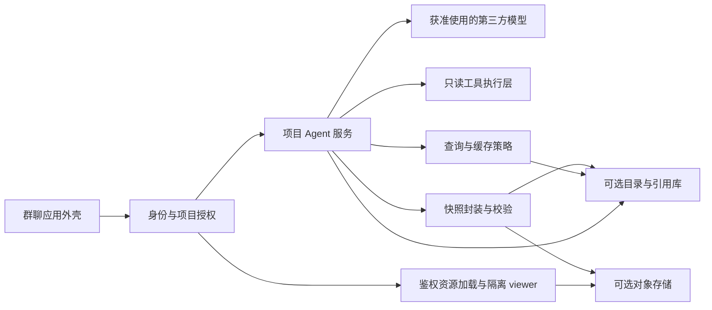

# 序言：后续研发框架与开发计划

版本：计划 v3 · 2026-09-12 · 生产优先路线已确认

本文件保留完整研发规划。P1 与本地动态生成切片已完成自动检查，实际状态见 docs/STATUS.md。2026-09-12 起以 `docs/PRODUCTION_RELEASE_PLAN_2026-09-12.md` 为近期执行依据；本文早期工作量估算和 D1/R2 顺序仅保留为历史背景。

## 1. 建议批准的方向

保留现有群聊体验和真实模型代理，以一个模块化应用实现 PRD 的四个模块，按可验收的完整用户流程推进。

用户已明确新的研发顺序：**① GUI → ② 快照协议与数据结构 → ③ 模型接入 → ④ 自由对话生成快照 → ⑤ Timeline Agent Support 真实取数 → ⑥ 项目数据全真替换 → ⑦ 公司 OAuth 与真实用户 → ⑧ 阿里云生产发布 → ⑨ 持久化与缓存优化。** 前四项作为已具备基线，近期从第 ⑤ 项开始。

首发目标是最快打通真实用户、真实项目、真实 Timeline 数据和模型生成快照。首发可以不提供缓存和跨会话持久化，每次请求允许重新取数和生成；但数据真实性、公司 OAuth、服务端授权、快照校验和 viewer 隔离不能后移。刷新回放、模型离线回放、查询复用和 token 优化在上线后按真实证据建设。

旧计划的 28 个工作日 + 7 天缓冲不再作为首发承诺。完成 Timeline 协议探测、公司 OAuth 参数确认和阿里云运行产品选择后，再基于真实外部依赖重估剩余时间；不为维持旧排期提前实现存储或缓存。

用户已提供 Timeline 看板及接入指南，指定看板 ID 为 `cd620e2ebb1739b1`；测试项目暂名“Timeline 看板快照验证”。[初始上下文稿](/Users/linan/Desktop/SnapshotCache/docs/TIMELINE_TEST_PROJECT_CONTEXT.md)已整理，密码单独作为服务端凭据配置，不进入上下文、提示词、日志或快照。下一开发阶段直接按实际 Agent Support 协议只读取数并生成真实快照。

## 2. 现状：哪些可以保留，哪些还没有完成

核对范围：PRD v0.2、快照协议设计稿、README、当前服务端与前端、构建脚本及测试。P1 基线提交为 `bb24a09`；P2 动态生成切片仍在本地未提交工作区。

- **表现层：GUI 基线已具备。** 项目切换、新建与归档、成员管理、上下文编辑、聊天、动态快照、移动端和键盘流程已通过本地浏览器测试。生产路径仍需移除硬编码项目／成员／样例内容并接入真实身份。
- **快照：协议和运行边界已具备。** 已有机器可读 Schema、7 个真实文件 fixture、RFC 8785 hash、通用校验器、隔离 viewer 和稳定引用语义。fixture 业务数据均为 dummy，只用于回归。
- **缓存管理：尚无真实服务。** 没有持久目录、查询指纹实现、active 指针、TTL、生成协调或浏览器缓存实现。当前示例标识不能计入缓存完成度。
- **项目 Agent 服务：文本与动态快照生成已具备。** `/api/chat` 有模型适配、文本／快照分流、严格候选、一次修复、服务端受信字段、输入限制和错误处理。仍没有 Timeline 工具取数、真实项目配置、公司 OAuth、自动摘要或长期记忆。
- **共享基础：已有本地 Node、Sites Worker 构建和 D1/R2 原型。** 生产平台很可能迁移到阿里云；当前代码尚未完成平台解耦或阿里云预发布。本地 Git 未配置 remote，最新 P2 代码尚未提交。

2026-09-12 重跑 `npm run check`，28 项 Node 测试、Worker／前端构建和 7 个 fixture 校验通过；`npm run test:e2e` 的 Chromium／WebKit 共 20 项通过。这些证据证明本地基线，不代表 Timeline、公司 OAuth、阿里云或真实生产授权已经验收。

主要证据：

- [现有能力边界](/Users/linan/Desktop/SnapshotCache/README.md:11)
- [客户端提交项目与历史](/Users/linan/Desktop/SnapshotCache/dist/app.js:102)
- [服务端现有信任边界](/Users/linan/Desktop/SnapshotCache/server/api.mjs:24)
- [内存项目目录](/Users/linan/Desktop/SnapshotCache/dist/project-directory.js:3)
- [现有测试](/Users/linan/Desktop/SnapshotCache/tests/api.test.mjs:10)
- [快照协议草案](/Users/linan/Desktop/SnapshotCache/docs/SNAPSHOT_SPEC.md)
- [第一阶段验收范围](/Users/linan/Desktop/SnapshotCache/PRD.md:300)

PRD 保留完整产品目标，生产首发计划定义近期最小范围，STATUS 只记录有证据的实现。不得用无状态首发暗示持久化、历史回放或缓存已经完成。

## 3. 采用的 AI 辅助开发方法

截至本次检索，官方建议强调明确任务上下文、简短持久规则、相关测试与代码审查，并在流程稳定后再封装技能和自动化。本计划据此采用“小任务、短反馈、可追溯验收”的工作方式；以下排期与管理制度是本项目建议，不是官方规定。[Codex 最佳实践](https://learn.chatgpt.com/guides/best-practices)

每个研发任务固定经历：

1. **明确结果：** 绑定 PRD 条目，写出用户场景、范围和验收条件。
2. **准备约束：** 读取相关代码、契约和已接受决策；只给当前任务必要上下文。
3. **实现一个切片：** 一个变更只解决一个可验收目标，通常 0.5–1 天；超过 2 天拆分。新协议、权限或并发问题先定义反例。
4. **提供证据：** 跑相关测试，必要时验证真实运行环境，说明未测范围。
5. **审查与验收：** 核对差异、异常路径与回退方法；涉及产品取舍由你决定。
6. **回写状态：** 更新任务、测试结果、必要决策及已知风险，再开始下一项。

默认同时只推进一个实现任务。代码生成、测试和审查是不同工作步骤，不因使用 AI 就省略审查，也不把同一次生成后的自我评价当作独立证明。先稳定单执行者流程，确有独立任务且另获授权时再考虑并行代理；这与 PRD 中暂不做产品内多 Agent 是两件事。

建议每日节奏：15 分钟确认目标，两个各约 90 分钟的实现与相关测试循环，45 分钟集成审查，30 分钟演示和更新记录；余下时间处理阻塞和返工。每周一次 30 分钟范围与风险复盘，不按代码行数或提交数量考核进度。

## 4. 开发框架与技术边界

### 4.1 四模块保持逻辑独立，共享可信基础



上图描述最终职责，不代表首发必须同时实现。当前已打通 dummy 包 → 校验器 → viewer → Agent 动态生成；近期加入真实 Timeline、真实项目和 OAuth。持久目录与缓存发布后再接入。

这个框架的关键是：UI 展示服务端事实；Agent 提出意图；可信服务执行权限、取数、状态转换和提交。把上述职责分别放入目录和接口，第一版仍是一套应用，不拆四个微服务。

**表现层**只持有项目 ID、消息 ID、快照引用及临时交互状态。成员身份从服务端解析；新 API 提交 `projectId`、消息正文、引用和幂等键，服务端加载当前配置与已持久化历史。普通成员之间的消息也要真实保存和同步，不只是“用户与模型聊天”。初期用带游标的轮询同步，先保证排序、去重和权限撤销；实时推送按实测需求再引入。

**快照模块**提供封装、验证和读取契约。按协议冻结 query、数据、H5、依赖及 manifest；`snapshotId` 由服务端分配，hash 由实际字节计算。首阶段用确定的 dummy data 与预制 H5 建立可校验样例；第二阶段再由模型动态生成符合相同契约的自包含 H5，保留任意数据类型和表现形式的协议空间，但不要求首版实现所有格式的解码器。不将固定模板渲染冒充 Agent 已能生成任意页面。

**缓存模块**负责指纹规范化、fresh/stale/expired 判断、active 版本、容量和淘汰；按 ID 历史回放单独处理。先做正确性，再做命中率优化。对无法安全规范化的请求选择不复用，不用向量相似度直接判命中。

**Agent 模块**逐步拆成模型适配、上下文组装、工具执行、回答／快照流程、记忆更新和执行记录。第三方模型保持可替换；开发工具使用 Codex 不代表产品必须更换 DeepSeek，评测工具也不绑定某一家模型。

### 4.2 推荐技术取舍

- **部署平台可替换，阿里云优先评估。** 现有 Sites／Worker 构建保留用于本地和现有环境，但 HTTP、密钥、身份、工具与存储通过适配层隔离。生产运行形态在阿里云产品确认后落定，不安排整站框架重写作为前置。
- **首发默认无状态。** 当次请求内完成取数、生成、校验和展示；不要求消息、run、快照目录或资源跨请求保存。无状态不能绕过项目授权、来源核对或内容校验，界面也不能暗示已经保存。
- **D1/R2 是原型而非约束。** 已实现代码保留为可选适配器和行为测试参考。生产存储在发布后根据阿里云架构选择；快照协议不得包含 D1/R2 特有语义。
- **持久化先于缓存。** 发布后先保存不可变快照和消息引用，恢复刷新／跨会话回放；再根据真实延迟和 token 消耗实现查询身份、active、TTL、生成协调和各级缓存。Redis 或具体阿里云产品不预设。
- **首发不依赖持久任务。** 首发请求在受控超时内同步完成或明确失败，不宣称中断恢复、无人访问时后台继续或幂等费用保护。持久化阶段再加入 run、检查点、租约和恢复。
- **密钥管理先满足阿里云首发。** 模型、Timeline 和 OAuth 密钥使用部署平台的服务端密钥能力，与代码、前端、提示词、日志和快照分离。后续若开放用户配置连接，再设计加密持久化、轮换和停用。自定义模型 URL／工具地址必须限制目的地与重定向，防止成为任意网络代理。
- **隔离 viewer 必须先于运行生成代码。** 候选 H5 只作为不可信文件处理，不能在业务 Worker 中直接执行，也不能让模型触发任意 npm 安装。用 sandbox 与 CSP 限制网络、表单、弹窗、导航和宿主访问；资源由宿主验证后交付，桥接消息核对窗口、协议和一次性能力。优先自包含 H5，复杂动态模块需 viewer 契约明确支持后再接入。[MDN iframe 隔离说明](https://developer.mozilla.org/en-US/docs/Web/HTML/Reference/Elements/iframe)
- **浏览器缓存不成为授权来源。** 首发不要求 IndexedDB 或 Cache Storage。后续接入时，每次打开仍向服务端检查当前权限；登出、切换身份和权限撤销时清理对应缓存。已经发送到用户设备的数据不能承诺远程收回。

建议目录在批准后按实际用到的部分逐步生成：

```text
AGENTS.md                     简短总规则和文档导航
docs/STATUS.md                当前能力、证据、缺口
docs/BACKLOG.md               任务、依赖、验收、状态
docs/decisions/               重要研发决策 ADR
docs/testing/                测试策略、用例索引、发布证据
contracts/                   API、快照和 viewer 契约
examples/                    可实际校验的快照包
src/web/                     产品表现层
src/snapshot/                打包、完整性验证、viewer 协议
src/cache/                   查询身份、新鲜度、提交协调
src/agent/                   模型、上下文、工具、记忆
src/platform/                身份、授权、存储、日志、配额
db/schema.ts + drizzle/      数据模型与不可改写的已应用迁移
tests/                       单元、契约、集成、端到端测试
evals/                       模型行为样本、评分规则、运行摘要
scripts/                     构建和质量检查入口
dist/                        生成产物
```

不创建没有消费者的通用框架、空技能库或大型管理后台。

## 5. 管理规则与匹配工具

### 5.1 需求与进度管理

**规则：** PRD 描述目标；STATUS 描述已验证实现；BACKLOG 管理任务。任务必须包含 ID、PRD 来源、模块、前置依赖、验收条件、测试要求、估算、负责人和证据链接。状态为 Proposed → Ready → Doing → Review → Done，Blocked 必须写阻塞项及下一步。Done 以验收证据为准，不以“代码已写完”为准。

**工具：** 先用仓库 Markdown + Git。当前无需安装 Jira、Linear、Asana 或其他管理平台；如果团队已有指定系统再同步，避免两份状态互相矛盾。本地目前没有 remote，代码备份／协作托管地址在 P1 建立最小研发基线时确定；Sites 发布历史不能自动视为完整源码协作备份。

### 5.2 决策管理：区分研发决策与产品内记忆

**研发决策 ADR**记录协议、身份权限、存储、密钥、隔离、依赖和上线取舍；**产品内决策记忆**属于 Agent 的业务能力，必须引用用户消息和资料。两者不混用，不让产品 Agent 自动改项目研发 ADR。

ADR 最小字段：问题、约束、备选方案、选择与理由、后果、验证办法、决策人、关联任务、日期；状态为 Proposed／Accepted／Superseded／Rejected。被替代的 ADR 保留并链接新决定。

按使用阶段确认的候选决策：

- ADR-0001：dummy 快照与表现层优先，Agent 动态生成其次。
- ADR-0002：P2 使用 D1/R2 的原决策；其首发前置顺序已被 ADR-0003 部分替代。
- ADR-0003：真实 Timeline、真实项目和公司 OAuth 优先，允许无状态首发，阿里云优先评估。
- 后续候选：公司 OAuth 与项目授权模型、Timeline 工具权限、阿里云运行形态、发布后持久存储选型。

已接受 ADR 的范围按其状态执行。日常命名、局部函数拆分等可逆细节由开发执行；生产平台、OAuth 授权口径、持久协议破坏性变化、权限放宽和新增持续费用由产品负责人确认。

### 5.3 AI 工作规则

**工具：** 批准后新增根目录 AGENTS.md，用短规则链接专项文档。AGENTS.md 是持久指导入口，可按目录设置局部说明。[AGENTS.md 官方说明](https://learn.chatgpt.com/docs/agent-configuration/agents-md)

拟写入的规则包括：

1. 以当前任务验收和已接受 ADR 为依据；先核实代码，不把规划当成实现。
2. 项目、成员、上下文和权限由可信服务端解析，不能信任客户端或模型声明。
3. 快照提交后不可覆写；消息绑定确定引用；失败不能替换旧结果。
4. 不把模型生成数字标成真实取数，不编造命中、成功和测试结果。
5. 不把凭据写入前端、日志、提示词、样例或快照。
6. 每个变更运行对应风险级别的检查；权限、完整性、并发与数据丢失必须有反例测试。
7. 不顺手重写无关模块或更换框架；依赖变更说明原因并保存锁文件。
8. 完成时提供改动、验证证据、未测范围与风险；顺带更新事实状态。

技能只封装反复出现的流程：先执行 2–3 次再视需要形成“交付任务”“决策记录”“快照验证”“发布验收”技能。现有 Sites 技能可沿用；规则创建和技能创建工具在落地阶段使用。本轮不安装插件或创建自动化。

### 5.4 测试管理

**代码测试：** 保留当前 `node:test` 与 Playwright。Timeline、OAuth 和阿里云接入分别增加契约／集成测试，避免只在 Node mock 中成立。D1/R2 测试保留给原型；选择生产存储后再采用该平台的真实运行时集成测试。

**浏览器测试：** Playwright，按用户可见行为和角色定位元素，账号与测试数据隔离，失败保存 trace。先覆盖关键流程，再增加低频边界；不使用大量整页截图代替功能断言。[Playwright 最佳实践](https://playwright.dev/docs/best-practices)

**协议测试：** JSON Schema 2020-12 校验外形，选用支持相应草案与 format 校验的实现；RFC 8785 规范化、资源引用闭合、文件字节和并发状态另测。JCS 不手写一个简单排序函数代替。实现阶段锁定可在 Worker 运行的库和版本，配官方测试向量。

**模型效果评测：** 仓库 JSONL 样本 + 可调用当前模型适配器的轻量 runner；可按需要评估现成框架，第一版不要求采购平台。用确定性断言验证来源和状态，用人工标注／校准的评分评价语义。提示词、模型、上下文选择或工具逻辑改变时运行相关样本集。[模型评测最佳实践](https://developers.openai.com/api/docs/guides/evaluation-best-practices)

**统一记录：** 每条用例关联 PRD／任务、前置数据、输入、期望行为、测试层级和优先级；每次关键运行记录 commit、环境、数据版本、时间、结果和证据路径。未实现测试标为计划，不计入通过数。

### 5.5 变更、发布与运行管理

**规则：** 小变更、可追溯提交、必要时 `codex/` 分支；迁移先检查、先本地验证、再发布。已应用迁移不可覆写；数据库变更采用向前兼容方式，回退应用不假设数据库会自动回退。

**工具：** 本地统一质量命令 + Git 差异审查；预发布和生产使用最终选定的阿里云工具链。现有 Sites 只作为当前构建兼容目标，不视为生产发布系统。若后续选 GitHub 托管，则用 GitHub Actions 在 PR／提交上运行相同质量入口。[GitHub Actions](https://docs.github.com/actions)

**运行证据：** 从第一条链路起记录 requestId、projectId、actorId、runId、模型与配置版本、工具来源、耗时、错误类别、snapshotId、命中状态和用量；不记录明文密钥，敏感正文默认不进通用日志。先输出结构化日志和基本查询，规模需要时再接专业可观测平台。

发布前输出：本次范围、测试结果、遗留问题、迁移说明、备份／恢复办法及回退版本。技术执行遵循已授权范围；产品发布由你按里程碑验收，本轮规划批准不自动改变现有站点访问范围。

## 6. 当前生产路线与退出条件

完整任务、阻断条件和发布边界见 `docs/PRODUCTION_RELEASE_PLAN_2026-09-12.md`。当前顺序为：

1. **R0 · 冻结已具备的 1–4：** GUI、快照协议、模型接入和自由对话生成快照完成真实模型最小复核并建立代码检查点。
2. **R1 · Timeline Agent Support：** 完成只读协议探测、工具白名单、来源记录和真实快照核对。
3. **R2 · 项目数据全真：** 生产路径移除 dummy 与前端自报项目事实，改由服务端真实项目配置驱动。
4. **R3 · 公司 OAuth：** 接入真实用户、成员映射和服务端授权，严重越权用例为零。
5. **R4/R5 · 阿里云预发布与生产：** 确定运行产品，在类生产环境跑通真实纵向链路后小范围上线。
6. **R6 · 发布后优化：** 先补快照／引用持久化，再依据延迟和 token 成本补缓存。

首发退出条件：真实 OAuth 用户可以进入获准项目，自由对话并让模型从获准 Timeline 数据生成可核对、协议合规、隔离运行的快照；无 dummy 冒充、越权、写操作或秘密泄露。刷新回放、模型离线回放和缓存命中不属于首发退出条件。

## 6A. 历史阶段计划（已被 v3 顺序取代）

以下 P1–P4 内容保留用于解释原估算和已实现代码来源，不再决定当前执行优先级；凡与本节及生产首发计划冲突，以 v3 为准。

### P1 · dummy data、快照与表现层 · D1–D6 · 6 天

这是首个研发阶段，目标是拿到真正的快照文件和可交互的页面。无需等待模型、业务数据源或完整成员系统。

- BASE-01：随首个快照任务建立最小 AGENTS.md、任务与决策记录、相关测试入口；同步实现状态，整理必要的源码／dist 边界和源码备份。只做本阶段实际需要的基线工作。
- FIXTURE-01：准备固定、可重复的 dummy 数据与查询上下文，标明模拟来源，包含正常数据、空数据和边界值。业务内容用于验证协议与交互，不冒充用户的测试项目事实。
- SNAP-01：冻结快照 v1 最小契约；保存 query、JSON 数据、Markdown 说明、H5、依赖和 manifest，全部 hash 与字节数来自实际文件。建立可重复生成与核验样例的脚本。
- SNAP-02：实现 Schema、资源引用、路径、入口、大小与内容完整性校验；覆盖合法包、缺失资源、篡改文件和不兼容协议。
- VIEW-01：建立隔离 viewer 与加载适配器，将真实包接入群聊的受控挂载点；支持展开、切换视图、筛选等交互及加载失败状态。
- REF-01：样例消息绑定确定的 snapshotId + manifestHash；按 ID 重载同一份包。编辑数据或保存新的初始状态产生新包，旧引用保持稳定。

退出条件：不调用模型也能从实际快照包加载完整页面；数据、页面及初始状态一致；刷新后可重新打开样例；篡改／缺件被拒绝；用户可以直接验收群聊内的快照体验。通过此阶段只说明“快照与表现层可工作”，不计为 Agent 动态生成或真实业务取数。

### P2 · Agent 动态生成快照 · D7–D12 · 6 天

依赖 P1 的协议、校验器和 viewer。先沿用已接通的模型代理，以及可控的输入／测试数据，验证动态生成机制。

- AGENT-01：拆出模型适配和生成流程，输入项目上下文、问题与数据，输出回答或快照候选包；普通文本问题仍可仅回答文本。
- GEN-01：Agent 动态组织数据绑定与 H5 表现层，接入 P1 同一打包、校验和加载流程。验证生成结果确由当次模型产生，不能把加载预制样例当作生成成功。
- STORE-01：接入最小服务端项目作用域、执行记录、R2 不可变包和 D1 目录／稳定引用；不以浏览器状态作为真实生成记录。
- RUN-01：候选 → 校验 → 持久提交 → 消息引用的状态流；请求幂等、失败重试与中断恢复。失败不提交破损包，也不修改已有消息或结果。
- SEC-01：密钥保留在可信服务端，生成 H5 隔离执行；对存储和生成结果读取执行当前授权检查。在受限测试访问范围内推进，不提前开放多人使用。

退出条件：用户提问后，Agent 可以动态生成符合协议的新包并在既有 viewer 中展示；不同数据／表现要求能得到对应结果；可追溯输入、模型、生成时间及校验结果；模型不可用时历史包仍可按 ID 回放。这个阶段可使用标注清楚的测试数据，真实业务正确性由 P3 验收。

此时新查询直接执行生成；重试同一请求按幂等键处理。尚不实现跨请求查询复用、active、TTL、热缓存或淘汰。

### P3 · 指定上下文的测试项目与真实快照 · D13–D22 · 10 天

依赖 P2。用户已提供 Timeline 看板地址、ID、密码和接入指南；按[测试项目初始上下文](/Users/linan/Desktop/SnapshotCache/docs/TIMELINE_TEST_PROJECT_CONTEXT.md)建立项目。只读授权范围内执行协议自发现、鉴权和取数；不执行指南中的卡片修改、指标回填或 change-set 提交。

- CASE-01：将用户原始上下文保存为可追溯的测试项目背景，确定项目名称、目标、约束、目标快照、预期交互和验收问题；记录确认后的事实与待补资料。
- CORE-01：持久化测试项目、消息、上下文与模型配置，按 projectId 从服务端加载；补齐项目归档／恢复、成员角色、幂等发送和必要的跨客户端同步。
- CONNECT-01：实现 Timeline 只读适配器：先探测 `/api/meta`，按实际文档读取端点／字段／分页；用服务端密码换 token，401 重认证并仅重试一次，429 遵守 retry_after，403 不循环。记录协议、能力、来源、观察时间、看板版本与分享范围，不硬编码示例限额或枚举。该适配器承担 PRD 的第一种只读数据源；不会调用任何看板写入端点。
- CONFIG-01：补齐工作空间“模型与连接”、连接验证／停用、项目继承／指定模型和动态凭据保管；补齐持久配额及必要的执行审计。
- AUTH-01：用真实测试身份验证项目隔离、成员移出和共享资料授权；单人私有结果不能自动公开到群聊。完整多人权限在开放相应使用范围前验收。
- MEM-01：自动上下文与长期记忆保存来源、类型、时间及版本；区分提议与决策，处理明确纠正和冲突，保留历史来源。
- MEM-02：后台摘要水位、待处理消息、重试与版本比较防丢失／旧覆盖；未摘要的相关消息仍进入请求；切换项目或模型保持隔离及记忆。记录实质上下文依赖，为 P4 的缓存身份提供输入，此时不实现缓存查询。
- CASE-02：从指定 Timeline 看板生成概览快照，按可用字段展示时间安排、状态、负责人及声明支持的分组／依赖。执行“首次生成 → 重新读取或改变展示要求 → 再次生成 → 旧快照回放”，逐项核对源数据、业务结论、表现层、版本和来源，不为测试修改源看板。
- EVAL-01：建立提取、纠正、来源、隔离和动态生成的评测基线，保存真实生成包及验收记录；缓存选择评测等 P4 实现后加入。

退出条件：用户指定上下文已真实进入测试项目；至少一份业务可核对的快照由 Agent 动态生成、校验、持久保存并显示；更新后得到新 snapshotId，旧包保持不变；业务来源和缺失信息诚实可见。上述群聊、配置、权限及记忆能力按 PRD 留有验收证据后，才将本阶段标为完整完成。

本阶段可先交付第一份真实快照，再完成剩余 Agent 和项目能力；它们仍归属于缓存开发之前的工作。若实际鉴权失败、看板不可用或业务字段缺失，记录具体阻塞或数据限制，不能把 dummy 结果作为真实取数通过证据。

### P4 · 最后开发缓存管理，并完成整体验收 · D23–D28 · 6 天

依赖 P3 的真实生成与项目能力验收。约 4 天缓存实现，2 天整体集成与发布准备。

- CACHE-01：可信查询规范化、意图版本、权限范围、实质上下文依赖、固定版本／latest 区分和时区展开；不确定是否等价时不复用。
- CACHE-02：active 指针、CAS、同查询生成租约及防旧任务提交标记。先持久提交包再竞争默认版本；旧任务不能覆盖新结果。
- CACHE-03：软／硬 TTL、过期刷新、刷新失败保留历史、服务端热缓存容量及淘汰；新查询命中与按 ID 回放独立判断。
- CACHE-04：IndexedDB／Cache Storage 的容量、校验及身份隔离；淘汰后从持久包恢复，读取仍鉴权，恢复不得重置数据新鲜度。
- QA-01：用 P3 同一测试项目验收命中、上下文／权限变化、软硬过期、并发生成和淘汰恢复；检查缓存接入前后业务结果一致。
- OPS-01：核验命中率、生成／加载耗时、失败率、大小、淘汰量、多实例配额与成本；完成备份恢复、迁移和回退演练。
- RELEASE-01：逐条核验 PRD 第一阶段范围，记录通过证据与遗留问题；你完成产品验收后进入相应发布步骤。

退出条件：真实快照闭环上增加可验证的安全复用；权限、记忆、来源和版本变化均正确影响缓存；整体验收无发布阻断项。未达标的能力明确标为未完成。

**D29–D35 为风险缓冲，不能提前分配新功能。** 原总量暂保留为 28 天基础工作量 + 7 天缓冲；P3 的 10 天是对单个范围受控测试项目的暂估。完成 Timeline 自发现与只读取数验证后重新核对数据接入与 Agent 工作量，必要时调整总工期，不通过压缩测试维持原数字。

## 7. 测试范围与质量门槛

### 7.1 优先验收场景

- AUTH-01：修改 projectId、消息 ID、snapshotId 或浏览器提交的历史，不能读取／污染另一项目。
- AUTH-02：成员被移出或工具授权撤销后，缓存命中、按 ID 回放、资源分段读取、后台摘要和未提交生成均按新权限处理。
- AUTH-03：某成员可读取但群聊其他成员不可读取的资料，不能未经处理进入共享消息、快照或长期记忆。
- CHAT-01：两客户端消息顺序一致，刷新恢复；发送重试不重复创建消息、任务或模型费用预留。
- SNAP-01：篡改文件、manifest、入口、MIME／绑定或 hash，均不能作为已验证快照运行。
- SNAP-02：路径穿越、重复条目、符号链接、超限文件及不闭合依赖被拒绝；若不支持 ZIP，则不开放 ZIP 解包入口。
- VIEW-01：恶意 H5 尝试读取宿主、外传、导航和伪造桥接动作均被边界拦截。
- CACHE-01：soft/hard TTL 等号边界正确；超硬 TTL 可按授权回放历史，但不能作为新查询有效命中。
- CACHE-02：同查询并发生成、租约过期、旧任务晚返回及写存储中断，不破坏旧 active；悬挂包可识别与恢复／回收。
- CACHE-03：淘汰后加载旧包仍保留原始时间；旧消息永远不悄悄切到新 active。
- MEM-01：提议不变成事实，明确纠正替代旧结论，来源能定位；无来源推断标为不确定。
- MEM-02：摘要失败重试、并发更新和未摘要消息不丢失；项目切换、模型切换与资料授权变化均正确。
- FAIL-01：模型／数据源／存储／校验失败各有真实状态，输入可恢复、旧快照不受损。
- OPS-01：包与元数据备份后可恢复历史引用；已应用迁移后的应用回退有验证记录。

### 7.2 检查频率

- **每个变更：** 相关单元／契约测试及适用的类型检查；修改构建、前端资源或 Worker 接口时验证构建。
- **集成／合并前：** 全部确定性测试、Worker 存储集成、关键浏览器流程；输出可复现报告。质量总入口计划为 `npm run check`，目前尚不存在。
- **提示词／模型／记忆／工具行为变更：** 跑受影响的效果评测及核心回归样本；默认测试不直接调用付费上游。
- **里程碑与发布：** 完整用户流程、少量真实模型／数据源联调、故障恢复与安全反例；真实评测成本单独设预算。

### 7.3 可验收的门槛

首发的身份权限、真实数据来源、只读工具边界、快照完整性和 viewer 隔离用例必须全部通过，且无已知越权、密钥泄露、伪造来源或 dummy 冒充问题。一次严重反例即阻断发布，不用总体通过率掩盖。不可变历史引用、提交并发和恢复用例在启用持久化前成为阻断门槛。

首发先建立最小真实模型样本，覆盖普通对话、Timeline 取数、两种快照表现、空／缺失数据和工具失败；业务字段由人工对照源响应。缓存选择、长期记忆和多轮纠正样本在对应能力开发时再扩充。严重越权、无依据业务事实和虚构取数成功必须为 0 次。

浏览器初期以 Chromium 为主，发布前核验关键流程在 WebKit；至少覆盖桌面、手机布局、键盘操作及错误状态。模型供应商调用时间与存储读取时间分别统计，不把模型慢归咎于缓存。

性能先固定测试环境、数据规模、并发和包大小，再比较缓存复用与重新生成的耗时。P3 采集真实项目基线，P4 定义并验收缓存性能目标；在无业务样本前不承诺虚构的毫秒指标或命中率。无论性能结果如何，各级容量、超时和费用上限必须有明确配置。

## 8. 当前阻塞条件、范围与第一步

指定项目的上下文与 Timeline 接入凭据已由用户提供；当前首要未知项是 Timeline 实例的实际 Agent Support 协议、API 基地址、鉴权、字段／数据量和一致性读取方式。尚未登录或取数，因此不能宣称已接通看板。

首发范围收窄为现有 GUI、现有模型、一种 Timeline 只读数据源、真实项目、公司 OAuth、真实快照和阿里云运行。持久记忆、完整消息历史、历史快照回放、缓存复用与统计后移。产品内多 Agent、外部系统写入、多运行时、跨项目共享记忆、整站 React 重写和复杂观测平台均不纳入首发。

2026-09-12 已确认三个核心取舍：

1. 前四项能力作为基线，立即转向 Timeline 真实数据、项目全真和公司 OAuth。
2. 首发可以无状态；D1/R2 不是首发前置，生产优先适配阿里云。
3. 上线后先补持久化，再根据实际响应速度和 token 消耗补缓存。

**批准后的第一步为 R0/R1：** 冻结当前 GUI、协议、模型与动态生成基线，随后直接探测 Timeline Agent Support 的只读协议并生成第一份可逐字段核对的真实快照。不得先继续扩展 D1/R2、缓存或历史回放。
